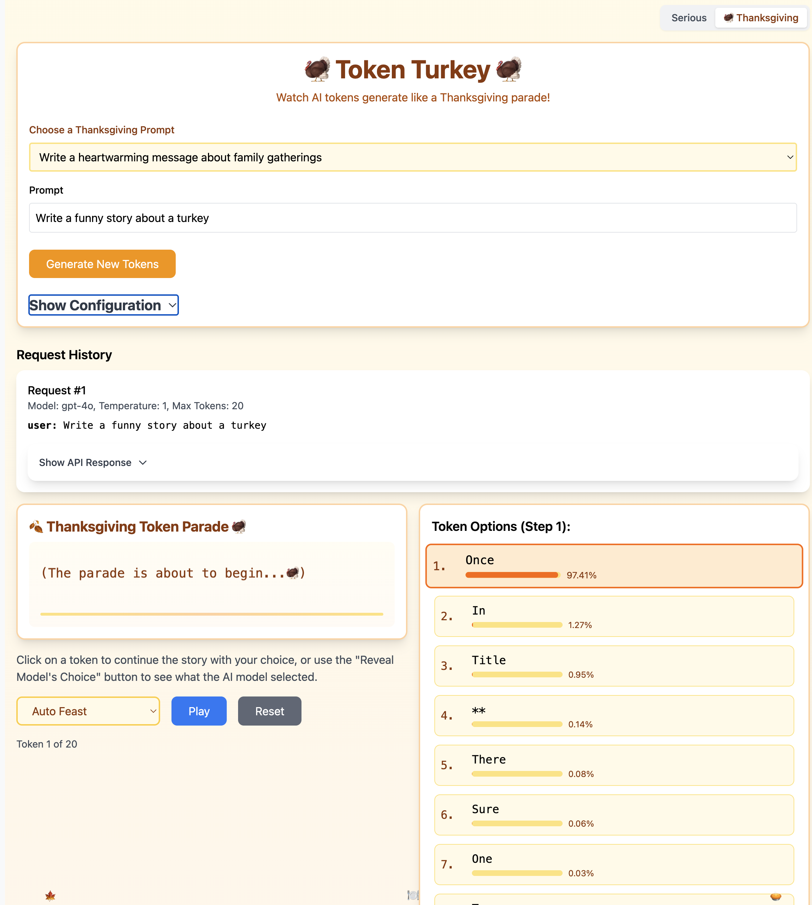

# OpenAI Token Visualizer

An interactive web application that visualizes how OpenAI's language models generate text token by token. It surfaces the probability distribution of possible tokens at each step of the generation process, and lets you either watch the model's choices play out or steer the generation by picking alternative tokens yourself.


## Features

- Real-time visualization of token-by-token text generation
- Display of token probabilities with visual probability bars
- Two playback modes:
  - **Auto Play** — automatically plays through the model's chosen tokens
  - **Step by Step** — manually reveal the model's choice, or click an alternative token to branch the generation
- Configurable parameters:
  - Temperature
  - Top logprobs count
  - Maximum completion tokens
- Support for multiple OpenAI models (GPT-3.5 Turbo, GPT-4, GPT-4 Turbo, GPT-4o, GPT-4o mini)
- Raw API response inspection and request history
- API key stored locally in `localStorage`
- **Two visual themes** — a "Serious" mode for normal use and a "Thanksgiving" mode left over from the hack day this project started as. Toggle in the top-right; your choice is remembered.

## Themes

This project began as a Thanksgiving hack day experiment, which is why it ships with a turkey-flavoured alter-ego.

- **Serious** — restrained gray/blue/green palette, plain "Generated Text" output, "Auto Play" / "Step by Step" labels. Use this when you want to show the tool to other people without explaining why there is a parade.
- **🦃 Thanksgiving** — amber/orange palette, "Token Turkey" header, parade-style animated token output with floating leaves and bouncing emojis along the bottom, "Auto Feast" / "Step by Step Recipe" labels, and a curated Thanksgiving prompt dropdown.


*Thanksgiving mode*

The theme defaults to Thanksgiving and is persisted to `localStorage` under the `theme_mode` key.

## Getting Started

### Prerequisites

- Node.js (v18 or higher recommended)
- An OpenAI API key with access to the chat completions endpoint

### Installation

1. Clone the repository:
   ```bash
   git clone https://github.com/guardian/logprobs.git
   cd logprobs
   ```

2. Install dependencies:
   ```bash
   npm install
   ```

3. Start the development server:
   ```bash
   npm run dev
   ```

4. Open the app in your browser, paste your OpenAI API key into the configuration section, and start generating.

### Other scripts

- `npm run build` — type-check and build a production bundle
- `npm run preview` — preview the built bundle locally
- `npm run lint` — run ESLint

## Usage

1. Pick a theme in the top-right (Serious or Thanksgiving).
2. Enter your OpenAI API key in the configuration section.
3. Choose your desired model and adjust generation parameters (temperature, top logprobs, max completion tokens).
4. Enter a prompt — or, in Thanksgiving mode, pick one from the dropdown.
5. Click **Generate New Tokens**.
6. Use the playback controls to step through the generation:
   - Auto mode: click Play / Pause to control automatic playback.
   - Step mode: click **Reveal Model's Choice** to see what the model picked, or click a different token in the right-hand list to branch the generation along an alternative path.

## Built With

- React + TypeScript
- Vite
- Tailwind CSS
- OpenAI Chat Completions API (with `logprobs`)

## License

MIT — see [LICENSE](LICENSE).
